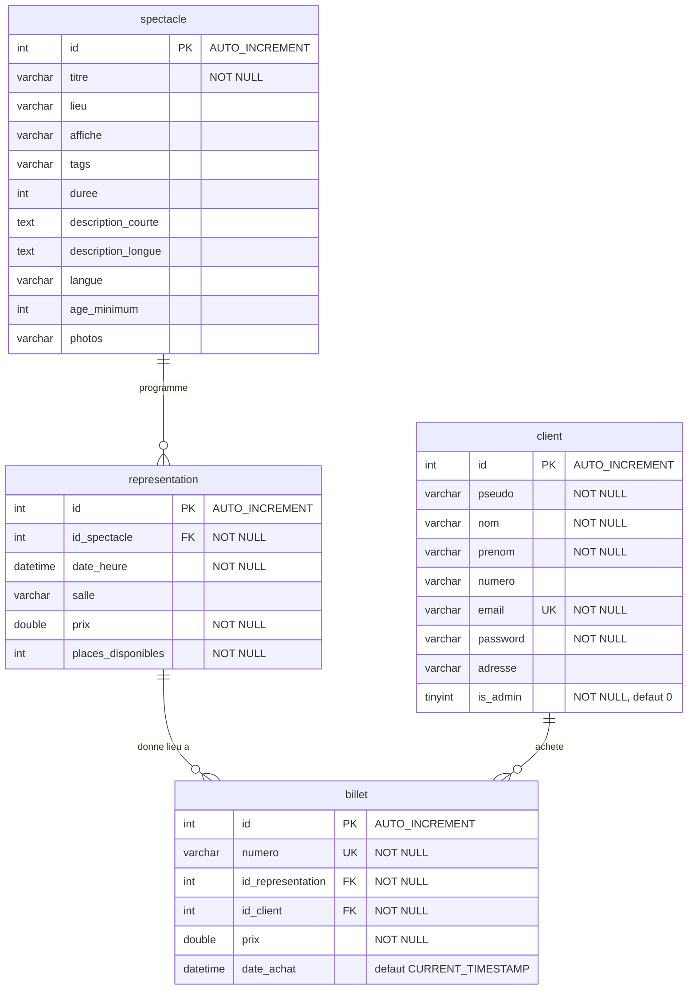

# 📐 Documentation — Modélisation de la base de données

Cette section documente le modèle de données de l'application **Billetterie Tic'n Go**.

> **Source de vérité** : le schéma SQL exécutable se trouve dans
> [`sql/billetterie_template.sql`](../sql/billetterie_template.sql). Les diagrammes
> ci-dessous en sont la représentation visuelle et doivent rester synchronisés avec lui.

## 🗂️ Fichiers de modélisation

| Fichier | Format | Outil de rendu |
|---------|--------|----------------|
| [`database/erd.mmd`](database/erd.mmd) | Mermaid (entité-association) | GitHub (natif), [mermaid.live](https://mermaid.live), VS Code |
| [`database/erd.puml`](database/erd.puml) | PlantUML (modèle physique) | [plantuml.com](https://www.plantuml.com/plantuml), VS Code, IntelliJ |

---

## 🧩 Diagramme entité-association (MEA)

Le diagramme suivant est écrit en **Mermaid** et se rend automatiquement sur GitHub :

---

## 🔗 Relations & cardinalités

| Relation | Cardinalité | Clé étrangère | Suppression |
|----------|-------------|---------------|-------------|
| `spectacle` → `representation` | 1 spectacle a 0..N représentations | `representation.id_spectacle` → `spectacle.id` | `ON DELETE CASCADE` |
| `representation` → `billet` | 1 représentation a 0..N billets | `billet.id_representation` → `representation.id` | `ON DELETE CASCADE` |
| `client` → `billet` | 1 client achète 0..N billets | `billet.id_client` → `client.id` | `ON DELETE CASCADE` |

> Conséquence du `CASCADE` : supprimer un **spectacle** supprime ses **représentations**,
> qui à leur tour suppriment les **billets** associés. Supprimer un **client** supprime ses billets.

---

## 📖 Dictionnaire de données

### `client`
| Colonne | Type | Contraintes |
|---------|------|-------------|
| id | INT | PK, AUTO_INCREMENT |
| pseudo | VARCHAR(50) | NOT NULL |
| nom | VARCHAR(100) | NOT NULL |
| prenom | VARCHAR(100) | NOT NULL |
| numero | VARCHAR(20) | — |
| email | VARCHAR(150) | NOT NULL, UNIQUE |
| password | VARCHAR(255) | NOT NULL (hash bcrypt) |
| adresse | VARCHAR(255) | — |
| is_admin | TINYINT(1) | NOT NULL, défaut `0` |

### `spectacle`
| Colonne | Type | Contraintes |
|---------|------|-------------|
| id | INT | PK, AUTO_INCREMENT |
| titre | VARCHAR(150) | NOT NULL |
| lieu | VARCHAR(150) | — |
| affiche | VARCHAR(255) | — |
| tags | VARCHAR(255) | — |
| duree | INT | en minutes |
| description_courte | TEXT | — |
| description_longue | TEXT | — |
| langue | VARCHAR(50) | — |
| age_minimum | INT | — |
| photos | VARCHAR(255) | — |

### `representation`
| Colonne | Type | Contraintes |
|---------|------|-------------|
| id | INT | PK, AUTO_INCREMENT |
| id_spectacle | INT | NOT NULL, FK → `spectacle.id` |
| date_heure | DATETIME | NOT NULL |
| salle | VARCHAR(150) | — |
| prix | DOUBLE | NOT NULL (prix par représentation) |
| places_disponibles | INT | NOT NULL (décrémenté à l'achat) |

### `billet`
| Colonne | Type | Contraintes |
|---------|------|-------------|
| id | INT | PK, AUTO_INCREMENT |
| numero | VARCHAR(50) | NOT NULL, UNIQUE (`TCK-YYYY-XXX`) |
| id_representation | INT | NOT NULL, FK → `representation.id` |
| id_client | INT | NOT NULL, FK → `client.id` |
| prix | DOUBLE | NOT NULL (copié au moment de l'achat) |
| date_achat | DATETIME | NOT NULL, défaut `CURRENT_TIMESTAMP` |

---

## 🗃️ Index

| Table | Index | Colonnes |
|-------|-------|----------|
| client | `idx_client_pseudo` | `pseudo` |
| client | `idx_client_nom_prenom` | `nom`, `prenom` |
| client | `idx_client_email_unique` | `email` (UNIQUE) |
| spectacle | `idx_spectacle_titre` | `titre` |
| spectacle | `idx_spectacle_tags` | `tags` |
| representation | `idx_rep_spectacle` | `id_spectacle` |
| representation | `idx_rep_date` | `date_heure` |
| representation | `idx_rep_prix` | `prix` |
| billet | `idx_billet_numero_unique` | `numero` (UNIQUE) |
| billet | `idx_billet_rep` | `id_representation` |
| billet | `idx_billet_client` | `id_client` |
| billet | `idx_billet_date` | `date_achat` |

---

## 🛠️ Comment générer les images

**PlantUML** (`erd.puml`) :
- VS Code : extension *PlantUML* (jebbs) → `Alt+D` pour prévisualiser.
- En ligne : copier le contenu dans [plantuml.com/plantuml](https://www.plantuml.com/plantuml).
- En ligne de commande : `java -jar plantuml.jar docs/database/erd.puml` (génère `erd.png`).

**Mermaid** (`erd.mmd`) :
- S'affiche automatiquement sur GitHub (voir plus haut).
- En ligne : [mermaid.live](https://mermaid.live).
- En ligne de commande : `npx @mermaid-js/mermaid-cli -i docs/database/erd.mmd -o erd.svg`.
